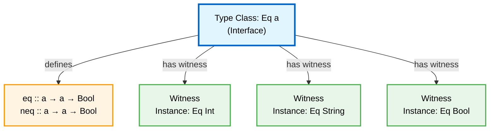
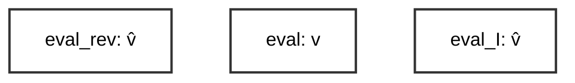
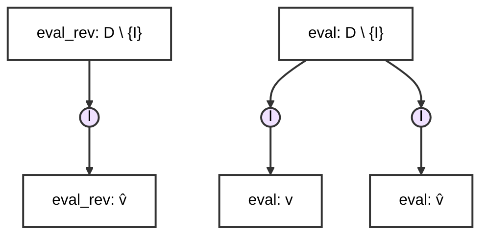
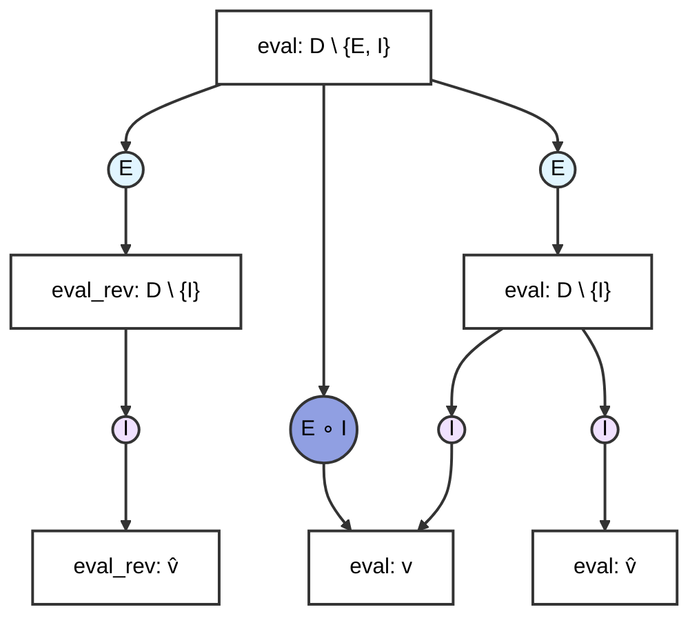

---
# try also 'default' to start simple
theme: seriph
title: Cumulative Semantics
info: |
  ## Cumulative Semantics
  Leveraging Generic Interfaces for Abstract Domain Accumulation

# apply UnoCSS classes to the current slide
class: text-center
transition: slide-left
# enable MDC Syntax: https://sli.dev/features/mdc
mdc: true
hideInToc: true
---
# Cumulative Semantics

## Generic Interfaces for Abstract Domain Accumulation

<Toc v-click minDepth="1" maxDepth="2"></Toc>

---

# What does it mean to accumulate semantics?

- parametric functions allow for the decoupling of return value
    + but how can you parameterize the direction of evaluation?
    + this goes lower than type level constructs

````md magic-move
```elixir
eval_forward(syntax, state): (Int, state')
```
```elixir
eval_forward_generic[D](syntax, state): (D, state')
```
```elixir
eval_bidirectional_generic[D](syntax, state): (D, state')
```
````

---

# Interfaces and Witnesses

- Type Classes allow polymorphism via the definition of an interface
    - A witness is an implementation the obeys this interface




---

# Resumptions and Continuations


````md magic-move
```elixir
# forwards
k(k(eval(s1,σ)), s2)
```
```elixir
# forwards
k(σ`, s2)
```
```elixir
# forwards
σ``
```
```elixir
# backwards
k(k(eval(s2,σ)), s1)
```
```elixir
# backwards
k(σ`, s1)
```
```elixir
# backwards
σ``
```

````

---

# Example Language

```
Expressions e ::= e
                 | cst(n)
                 | e1 + e2
                 | if(e1) e2 else e3
                 | var(x)
                 | seq(e1,e2)

Int         n ::= int
Ident       x ::= string
```

---
layout: two-cols
---

# Monolithic



::right::

````md magic-move
```elixir
def eval(e: expr, env:...): ...
```
```elixir
def eval(e: expr, env): int = match e
    ...
    | seq(e1, e2) => eval(e2, eval(e1, env))
```
```elixir {*|1}
def eval_I(e: expr, env): Interval = match e
    ...
    | seq(e1, e2) => eval(e2, eval(e1, env))
```
```elixir {*|1|3}
def eval_rev(e : expr, env_out): Set[str] = match e
    ...
    | seq(e1, e2) => eval(e1, eval(e2, env_out))
```
````

---
layout: two-cols
---

# Domain Generic



::right::

````md magic-move
```elixir {*|1|3|5}
eval(e: expr, env): D \ {I} = match e
    ...
    | plus(e1, e2) => plusI(eval(e1,env), eval(e2,env))
    ...
    | seq(e1, e2) => eval(e2, eval(e1, env))
```
```elixir {*|3}
eval_rev(e: expr, env): D \ {I} = match e
    ...
    | seq(e1, e2) => eval(e1, eval(e2, env))

```
````

---
layout: two-cols
---

# Complete Parametricity



::right::

```elixir {*|1|12}
eval(e: expr, env): D \ {E,I} = match e
    | cst(n) => cstE(env, n)
    | var(x) => varE(env, x)
    | plus(e1, e2) => plusE(env, e1, e2)
    | ifnz(e1, e2, e3) =>
        ifE(
            env,
            e1,
            e3,
            e2,
        )
    | seq(e1, e2) => seqE(env, e1, e2)
```

---

# State Representations

---

# Cumulative Abstract Semantics

- *Elimination* interfaces eliminate the source syntax and have access to interpretation ecosystem (introduction, lowering interfaces).

- *Introduction* interfaces provide abstract-domain specific semantics to an evaluator.

- *Lowering* interfaces provide abstract domain operators.

---

# Changes to the Recipe

---
