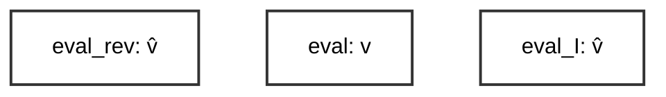
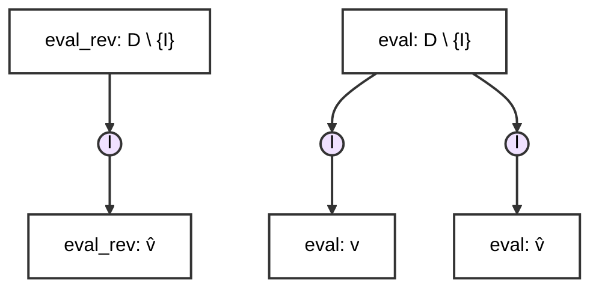
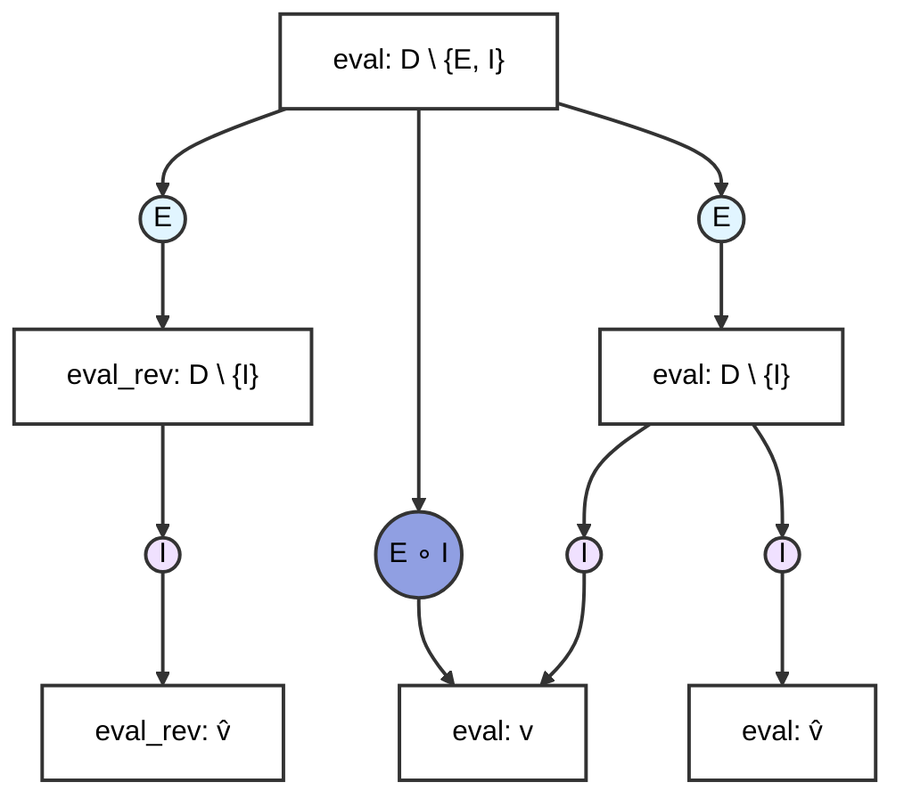

---
# try also 'default' to start simple
theme: seriph
title: Cumulative Semantics
info: |
  ## Cumulative Semantics
  Leveraging Generic Interfaces for Abstract Domain Accumulation

# apply UnoCSS classes to the current slide
class: text-center
transition: slide-left
# enable MDC Syntax: https://sli.dev/features/mdc
mdc: true
hideInToc: true
---
# Cumulative Semantics

## Generic Interfaces for Abstract Domain Accumulation

<Toc v-click minDepth="1" maxDepth="2"></Toc>

---

# Interfaces and Witnesses

---

# Resumptions and Continuations

---

# Example Language

```
Expressions e ::= e
                 | cst(n)
                 | e1 + e2
                 | if(e1) e2 else e3
                 | var(x)
                 | seq(e1,e2)

Int         n ::= int
Ident       x ::= string
```

---

layout: two-cols
---

# Monolithic



::right::

````md magic-move
```elixir
def eval(e: expr, env:...): ...
```
```elixir
def eval(e: expr, env): int = match e
    | cst(n) => n
    | var(x) => get(x)
    | plus(e1, e2) => eval(e1,env) + eval(e2,env)
    | ifnz(e1, e2, e3) =>
        if (eval(e1) == 0) {eval(e3,env)}
        else {eval(e2,env)}
    | seq(e1, e2) => eval(e2, eval(e1, env))
```
```elixir
def eval_I(e: expr, env): Interval = match e
    | cst(n) => [n, n]
    | var(x) => get(x)
    | plus(e1, e2) => 
        [l1, u1] = eval(e1, env)
        [l2, u2] = eval(e2, env)
        [l1 + l2, u1 + u2]
    | ifnz(e1, e2, e3) =>
        [l, u] = eval(e1,env)
        if (l <= 0 <= u) {  // crosses zero
            [l2, u2] = eval(e2,env)
            [l3, u3] = eval(e3,env)
            [min(l2, l3), max(u2, u3)]
        } else if (l > 0 || u < 0) {eval(e2,env)} 
        else {eval(e3,env)}
    | seq(e1, e2) => eval(e2, eval(e1, env))
```
```elixir
def eval_rev(e : expr, env_out): Set[str] = match e
    | cst(n) => {}
    | var(x) => {x} 
    | asgn(x, v) => eval_rev(v, env_out) ∪ {x} 
    | plus(e1, e2) => 
        eval_rev(e2, env_out) ∪ eval_rev(e1, env_out)
    | ifnz(e1, e2, e3) =>
        eval_rev(e3, env_out) ∪
        eval_rev(e2, env_out) ∪ 
        eval_rev(e1, env_out)  
    | seq(e1, e2) => eval(e1, eval(e2, env_out))
```
````

---

layout: two-cols
---

# Domain Generic



::right::

````md magic-move
```elixir
eval(e: expr, env): D \ {I} = match e
    | cst(n) => cstI(n)
    | var(x) => varI(x)
    | plus(e1, e2) => plusI(eval(e1,env), eval(e2,env))
    | ifnz(e1, e2, e3) =>
        ifI(
            eval(e1, env),
            eval(e3, env),
            eval(e2, env)
        )
    | seq(e1, e2) => eval(e2, eval(e1, env))
```
```elixir {*|11}
eval_rev(e: expr, env): D \ {I} = match e
    | cst(n) => cstI(n)
    | var(x) => varI(x)
    | plus(e1, e2) => plusI(eval(e1,env), eval(e2,env))
    | ifnz(e1, e2, e3) =>
        ifI(
            eval(e1, env),
            eval(e3, env),
            eval(e2, env)
        )
    | seq(e1, e2) => eval(e1, eval(e2, env))

```
````

---

layout: two-cols
---

# Complete Parametricity



::right::

```elixir
eval(e: expr, env): D \ {E,I} = match e
    | cst(n) => cstE(env, n)
    | var(x) => varE(env, x)
    | plus(e1, e2) => plusE(env, e1, e2)
    | ifnz(e1, e2, e3) =>
        ifE(
            env,
            e1,
            e3,
            e2,
        )
    | seq(e1, e2) => seqE(env, e1, e2)
```

---

# State Representations

---

# Cumulative Abstract Semantics

*Elimination* interfaces eliminate the source syntax and have access to interpretation ecosystem (introduction, lowering interfaces).

*Introduction* interfaces provide abstract-domain specific semantics to an evaluator.

*Lowering* interfaces provide abstract domain operators.

---

# Changes to the Recipe

---
