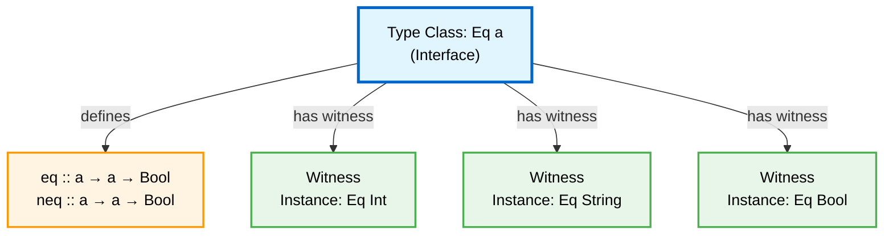
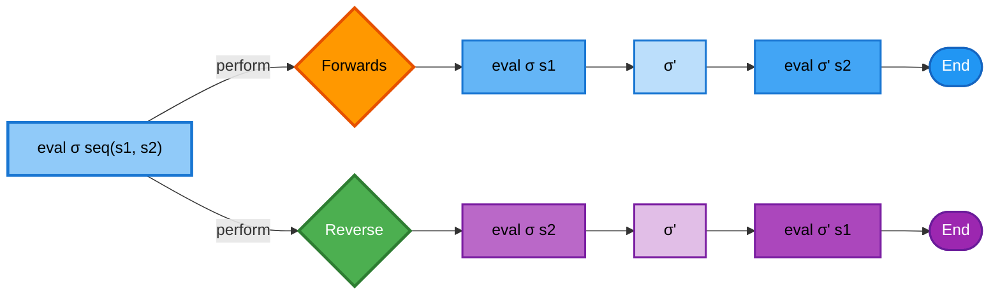
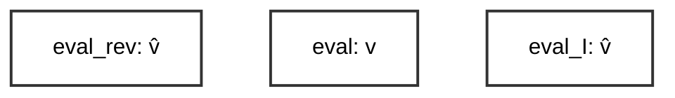
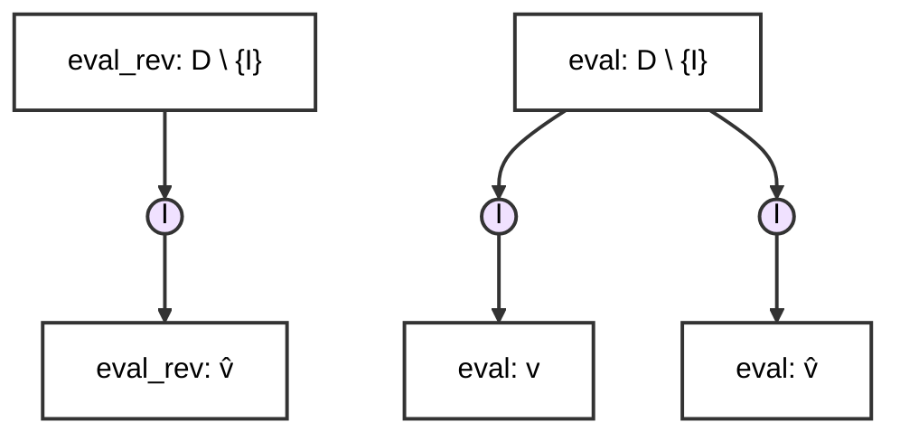
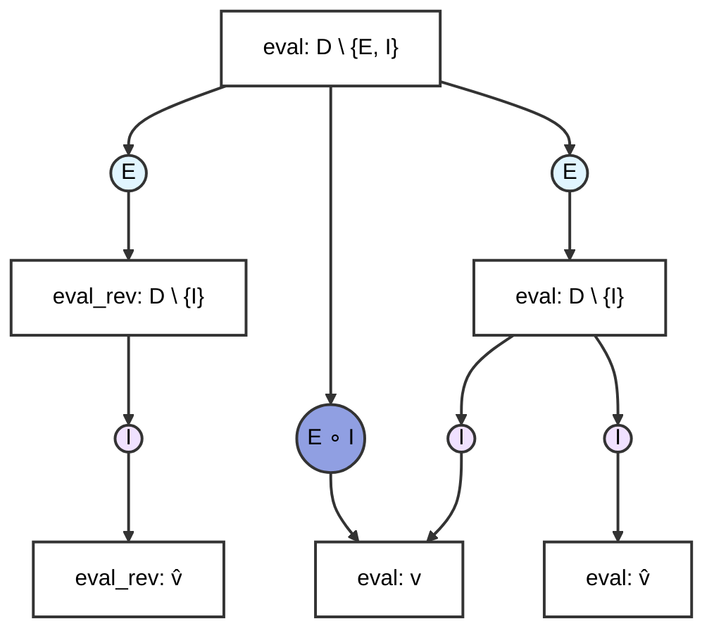
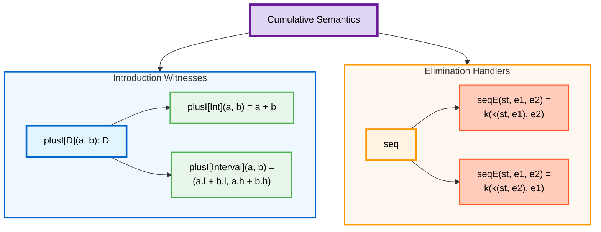

---
# try also 'default' to start simple
theme: seriph
title: Cumulative Semantics
info: |
  ## Cumulative Semantics
  Leveraging Generic Interfaces for Abstract Domain Accumulation

# apply UnoCSS classes to the current slide
class: text-center
transition: slide-left
# enable MDC Syntax: https://sli.dev/features/mdc
mdc: true
hideInToc: true
---
# Cumulative Abstract Semantics

## Generic Interfaces for Abstract Domain Accumulation

<Toc v-click minDepth="1" maxDepth="2"></Toc>

---

# What Is Accumulation of Semantics?

- Parametric functions allow for the decoupling of return value
    + But how can you parameterize the direction of evaluation?
    + This goes lower than type level constructs

````md magic-move
```elixir
eval_forward(syntax, state): (Int, state')
```
```elixir
eval_forward_generic[D](syntax, state): (D, state')
```
```elixir
eval_bidirectional_generic[D](syntax, state): (D, state')
```
````

---

# Interfaces and Witnesses

- Type Classes allow polymorphism via the definition of an interface
    - A witness is an implementation that obeys this interface




---

# Resumptions for Bidirectionality



````md magic-move
```elixir
def handle_forwards(s1, s2, k) =
    k(k(eval(s1,σ)), s2)
```
```elixir {2}
def handle_forwards(s1, s2, k) =
    k(σ`, s2)
```
```elixir
σ``
```
```elixir
def handle_backwards(s1, s2, k) =
    k(k(eval(s2,σ)), s1)
```
```elixir{2}
def handle_backwards(s1, s2, k) =
    k(σ`, s1)
```
```elixir
σ``
```

````

---

# Example Language

```
Expressions e ::= e
                 | cst(n)
                 | e1 + e2
                 | if(e1) e2 else e3
                 | var(x)
                 | seq(e1,e2)

Int         n ::= int
Ident       x ::= string
```

---
layout: two-cols
---

# Monolithic



::right::

````md magic-move
```elixir
def eval(e: expr, env:...): ...
```
```elixir
def eval(e: expr, env): int = match e
    ...
    | seq(e1, e2) => eval(e2, eval(e1, env))
```
```elixir {*|1}
def eval_I(e: expr, env): Interval = match e
    ...
    | seq(e1, e2) => eval(e2, eval(e1, env))
```
```elixir {*|1|3}
def eval_rev(e : expr, env_out): Set[str] = match e
    ...
    | seq(e1, e2) => eval(e1, eval(e2, env_out))
```
````

---
layout: two-cols
---

# Domain Generic



::right::

````md magic-move
```elixir {*|1|3|5}
eval(e: expr, env): D \ {I} = match e
    ...
    | plus(e1, e2) => plusI(eval(e1,env), eval(e2,env))
    ...
    | seq(e1, e2) => eval(e2, eval(e1, env))
```
```elixir {*|3}
eval_rev(e: expr, env): D \ {I} = match e
    ...
    | seq(e1, e2) => eval(e1, eval(e2, env))

```
````

---
layout: two-cols
---

# Complete Parametricity



::right::

````md magic-move
```elixir {*|1|7}
eval(e: expr, env): D \ {E,I} = match e
    | cst(n) => cstE(env, n)
    | var(x) => varE(env, x)
    | plus(e1, e2) => plusE(env, e1, e2)
    | ifnz(e1, e2, e3) =>
        ifE(env, e1, e3, e2)
    | seq(e1, e2) => seqE(env, e1, e2)
```
```elixir {*|5-8}
eval(e: expr, env): D \ {E,I} = match e
    ...
    | seq(e1, e2) => seqE(env, e1, e2)

def seqE(st, e1, e2) =
    st` = k(st, e1)
    st`` = k(st`, e2)
    seqI(st`, st``) 
```
```elixir {5-8}
eval(e: expr, env): D \ {E,I} = match e
    ...
    | seq(e1, e2) => seqE(env, e1, e2)

def seqE(st, e1, e2) =
    st` = k(st, e2)
    st`` = k(st`, e1)
    seqI(st`, st``) 
```
````

---

# Lowering Handlers

````md magic-move
```elixir {3-4}
eval(e: expr, env): D \ {E,I} = match e
    ...
    | ifnz(e1, e2, e3) =>
        ifE(env, e1, e3, e2)
```
```elixir {6-11}
eval(e: expr, env): D \ {E,I} = match e
    ...
    | ifnz(e1, e2, e3) =>
        ifE(env, e1, e3, e2)

def ifE(st, e1, e2, e3) =
    (g, st1) = k(st, e1)
    st2 = k(st1, e2)
    st3 = k(st1, e3)
    ifI(g, st2 , st3)
```
```elixir {7|8|9|10}
eval(e: expr, env): D \ {E,I} = match e
    ...
    | ifnz(e1, e2, e3) =>
        ifE(env, e1, e3, e2)

def ifE(st, e1, e2, e3) =
    (g, st1) = k(st, e1) # e1 ⇓ st
    st2 = k(st1, e2)     # e2 ⇓ st2
    st3 = k(st1, e3)     # e3 ⇓ st3
    ifI(g, st2 , st3) # pass resulting states to intro
```
```elixir {12-14|13|14}
eval(e: expr, env): D \ {E,I} = match e
    ...
    | ifnz(e1, e2, e3) =>
        ifE(env, e1, e3, e2)

def ifE(st, e1, e2, e3) =
    (g, st1) = k(st, e1)
    st2 = k(st1, e2)
    st3 = k(st1, e3)
    ifI(g, st2 , st3) 

def ifI(g, st2, st3) = match g
    | True  -> st2 # only use "then" state
    | False -> st3 # only use "else" state
```
```elixir {12-16|14-15|13}
eval(e: expr, env): D \ {E,I} = match e
    ...
    | ifnz(e1, e2, e3) =>
        ifE(env, e1, e3, e2)

def ifE(st, e1, e2, e3) =
    (g, st1) = k(st, e1)
    st2 = k(st1, e2)
    st3 = k(st1, e3)
    ifI(g, st2 , st3)

def ifI(g, st2, st3) =
    joinL( # deterime how to return / combine states
        assumeL(g, st2), 
        assumenotL(g, st3)
    )
```
````

---

# Cumulative Abstract Semantics

- *Elimination* handlers leverage continuations to eliminate the source syntax 
- *Introduction* witnesses provide abstract-domain specific semantics
- *Lowering* witnesses provide flow insensitive, reusable abstract domain operators



---
layout: two-cols
---
# Changes to the Recipe

Standard Recipe:

 1. Syntax
 2. Concrete Interpreter
 3. Collect Semantics
 4. Abstract Domain
 5. Abstract Interpreter

::right::

<div v-click>

## New Recipe:

 1. Syntax
 2. Generic Interfaces
 3. Concrete (Elim & Intro)
 4. Collecting (Elim)
 5. Abstract Domain (Lowering)
 6. Abstract Interpreter (Intro, *Elim*)

</div>

---

# Performance

- running the following Python program in the **Concrete Domain** with our
    - Lean4 typeclass and CPS implementation *compiles to a C++ binary*
    - Effekt scoped effekt system implementation *compiles to LLVM*
```python
x = 0
while x < 1000000
    x += 1
print(x)
```

````md magic-move
```sh
# running python test code with performance tool 'hyperfine'
hyperfine 'python3 while_perf.py'
```
```sh
Benchmark 1: python3 while_perf.py
  Time (mean ± σ):      53.3 ms ±   6.7 ms    [User: 48.5 ms, System: 3.3 ms]
  Range (min … max):    45.7 ms …  76.8 ms    61 runs
```
```sh
# run lean4 binary with performance tool 'hyperfine'
hyperfine "./.lake/build/bin/cumulativesemantics --while_perf --iterations 1000000"
```
```sh
Benchmark 1: ./.lake/build/bin/cumulativesemantics --while_perf --iterations 1000000
  Time (mean ± σ):     321.2 ms ±   6.3 ms    [User: 315.1 ms, System: 2.7 ms]
  Range (min … max):   313.6 ms … 333.6 ms    10 runs
```
```sh
# run effekt LLVM binary with perfomance tool 'hyperfine'
hyperfine ./out/concrete
```
```sh
Benchmark 1: ./out/concrete
  Time (mean ± σ):     624.9 ms ±  10.1 ms    [User: 622.6 ms, System: 1.9 ms]
  Range (min … max):   605.0 ms … 639.6 ms    10 runs
```
````

---

# Questions?
